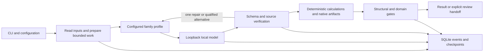

# Local workflow architecture

The system makes organizational judgment reusable by combining structured input contracts, small local inference tasks, deterministic calculations, source evidence, and durable execution records. Its current boundary is one laptop. Codex is a developer tool, outside the application's runtime and cost model.

## Execution path

`src/cli.js` is the command dispatcher. Configuration merges built-in defaults, user settings, project settings and supported environment variables. Policy requires local-only execution and rejects cloud enablement. Provider profiles use Ollama or an LM Studio-compatible endpoint on HTTP loopback. Redirects, URL credentials and remote-backed Ollama models are prohibited. The application does not download models, share credentials or use Codex authentication.

The provider verifies model availability and records advertised identity. Ollama exposes its model digest, quantization and engine version; unavailable fields remain unknown. A smoke probe tests a tiny structured response and is not a workflow qualification. Streaming records reported tokens and timing; timeouts, malformed streams and output truncation fail explicitly.

## Workflow and evidence contracts

The domain layer exports preparation, work-item verification and finalization. Preparation uses local document ingestion and creates bounded model requests. Each request supplies a schema, source identifiers, task family and source evidence. Model output must parse as JSON, satisfy the schema, and pass domain evidence checks before its checkpoint becomes reusable.

Arithmetic, row joins, duplicate detection, financial variance and native artifact writing are deterministic. Models make real contributions by extracting sign-ins and case fields or choosing supporting evidence for narrative requirements. Native PDFs, DOCX files and XLSX files are generated by Python libraries; filenames are not substitutes for binary formats. Scanned PDFs use local OCR. Nested input directories and extraction errors are retained rather than silently truncated or skipped.

Declared workflow gates have a registered implementation digest. Unknown or changed declarations cannot automatically pass. The original five public workflow IDs remain stable. Detailed required columns, policies, missing-evidence behavior, and bounded checks appear in [TASK-CATALOG.md](TASK-CATALOG.md). Stewardship is independently runnable and does not gate the other workflows.

An accepted artifact packet is different from an enacted decision. Conflicting hours, missing case fields, incomplete RFP evidence and unresolved ownership receive explicit review outcomes. Stewardship always has a human decision handoff. The domain gate ratio measures implemented checks, not hidden-reference accuracy or professional reliability.

## Routing and recovery

Family routing is explicit configuration. The coordinator first uses the assigned family profile or default, allows at most one evidence-based repair, and can try one configured alternative. It does not use parameter count or self-reported confidence as an automatic capability ranking. Context and attempt budgets are bounded. Before dispatch, the tested local tokenizer profiles use a conservative UTF-8 byte bound with output reservation and 1024 tokens for chat-template overhead; overlong requests fail. New model/tokenizer/template combinations require qualification, not an assumption that this reserve is universally sufficient. Qualify model/context combinations with task evidence before promoting them into routing configuration.

A PID-backed inference lock provides one active coordinator slot for this application. Other applications may still consume the laptop's resources. Accepted work units are saved in SQLite. Input-manifest and plan digests protect checkpoint reuse, and configuration changes require a new run. Cancellation and interruption retain state; resumed runs reuse accepted work. Fresh artifact-generation directories prevent stale files from satisfying new gates, and output containment rejects traversal and symlink escapes.

## Evaluation and provenance

Task packs separate `inputs/` from sibling reference answers. Evaluation runs receive only the input directory. The grader loads references after the workflow reaches a terminal outcome and compares actual artifacts independently of the engine's `passed` flag. Fixed-profile campaigns disable fallback, so a result can be attributed to the requested profile. The explicit `--provider routed` mode instead preserves configured family routing and fallback, and labels every slot as a system-routing comparison.

Campaign JSON records configuration, source-code and catalog digests, task/profile/repetition slots, run IDs, reference digests, grades and resource summaries. Atomic writes and campaign locks support bounded continuation without quietly rerunning finished failures. Configuration, source-code or catalog changes require a fresh campaign; reference changes during a campaign are rejected. A running process uses its imported code version, so later edits never retroactively validate prior measurements.

Reference outcomes distinguish completed substantive deliverables from correctly surfaced review or abstention. Normal cases cannot pass by producing only exceptions. In a scenario with no required inference source, a correctly blocked result can legitimately contain no model output, but must still retain readable artifacts, an explicit missing-input reason and accurate remaining-data accounting.

The checked-in suite contains generated, unreviewed synthetic references. Held-out variants are close perturbations, and deterministic test doubles are not model measurements. Domain gate results, reference agreement, expert review and production qualification are separate claims.

## Accounting and future fleet

Events correlate runs, work items, requests, tools, validators and artifacts. Usage includes failed attempts and repairs, distinguishes known and unavailable metrics, and samples coordinator/server memory and host pressure. Local detailed traces can contain case content; report exports use a content-restricted allowlist. Development subscription attribution stays separate from runtime accounting. See [ACCOUNTING.md](ACCOUNTING.md).

A future fleet can reuse the workflow and evidence contracts while adding remote local-serving nodes and PAIR. Current loopback policy deliberately prevents LAN dispatch. Distributed coordination, node authentication, cancellation, provenance and resource attribution require implementation and tests before fleet use. Qwen3.8 and larger local models should be evaluated against the same task outcomes before a routing claim is made.
